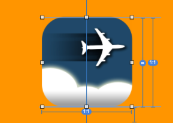

#  HKUIImageView # 
    
#### HK UIImageView Enhancements ####




## VERSION HISTORY ##

1.0.0 - 2020/01/18 - Initial release

## MINIMUM REQUIREMENTS ##

**Swift** 4.0 or above

**iOS** 11.0 or above


## WHAT IS IT? ##
`HKUIImageView` enhances the functionality of UIView by providing these additional features:

### Dynamic Corner Radius 
Allows you to dynamically calculate the corner radius base on one of the followings:

- the width of the label
- the height of the label
- the length of the shorter edge of the label (width or height)
- the length of the longer edge of the label (width or height)

- Or, it can also be set to a constant

This is useful for labels that change size (e.g. device rotation) or for catering to screen sizes of different devices (e.g., iPhone vs. iPad)

### Border Customization
It also let users customize the border width, color and alpha value for both normal and highlighted states.


## IMPORTANT!! ##

You **MUST** include this script at the end of your Podfile or the Inspectables won't work.

```
# This post_install section fixes a bug in CocoaPod that does not allow
# IBDesignables to render in interface builder

        post_install do |installer|
        installer.pods_project.targets.each do |target|
            target.new_shell_script_build_phase.shell_script = "mkdir -p $PODS_CONFIGURATION_BUILD_DIR/#{target.name}"
                target.build_configurations.each do |config|
                    config.build_settings['CONFIGURATION_BUILD_DIR'] = '$PODS_CONFIGURATION_BUILD_DIR'
                    config.build_settings.delete('CODE_SIGNING_ALLOWED')
                    config.build_settings.delete('CODE_SIGNING_REQUIRED')
                end
            end
        end
```
